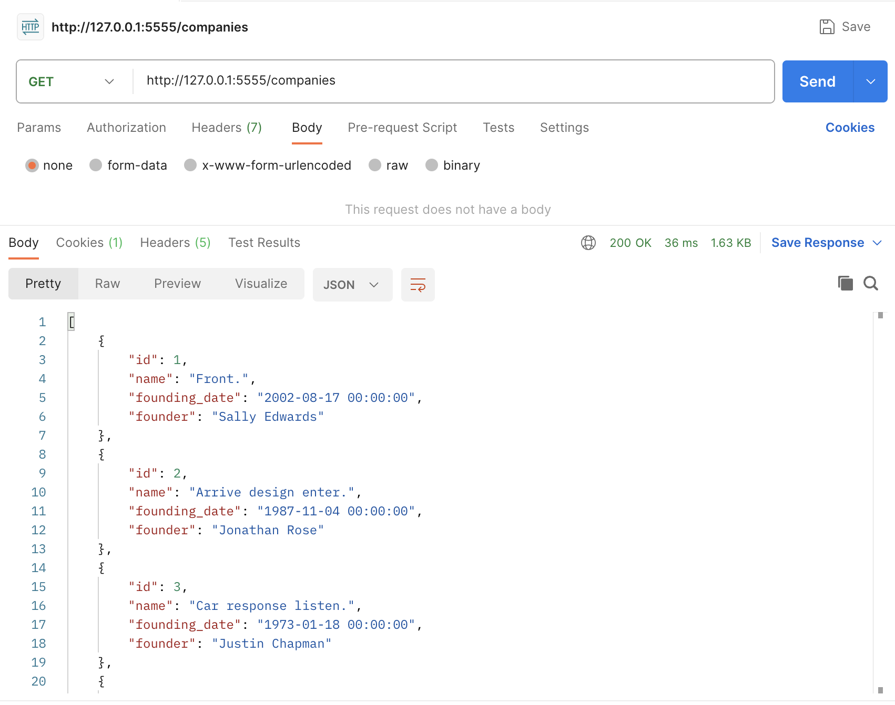
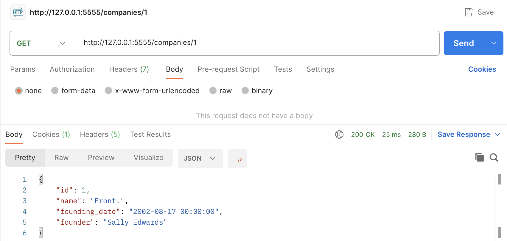
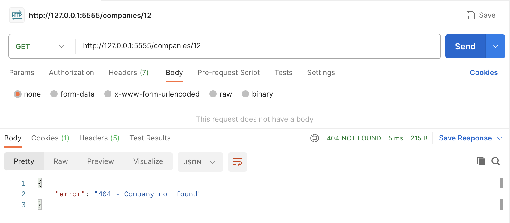
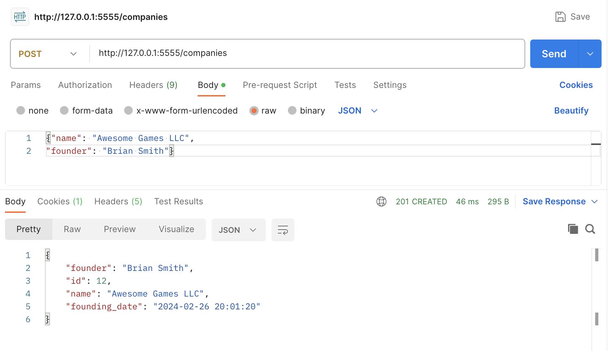

# Into to Flask-RESTful, walkthrough in Python

In this post, I will provide an overview of how to build simple RESTful routes using [Flask](https://flask.palletsprojects.com/en/3.0.x/). If you've retreived data from external APIs or used json-server in your frontend applications, you may already be familiar with RESTful conventions and HTTP request methods. But in this blog, we will be focusing on the server side/backend to explore how RESTful APIs really work behind the scenes.

## What is REST?

REST stands for Representational State Transfer and refers to a set of principles for network communication in applications. By adhering to [these constraints](https://codewords.recurse.com/issues/five/what-restful-actually-means), applications can use HTTP methods for routing in a standard, readable way to produce predictable behaviors.

## Flask-RESTful

In this demo, we'll be using [Flask-RESTful](https://flask-restful.readthedocs.io/en/latest/), a Flask extension that allows native support for HTTP request methods and simple RESTful routing. We'll be implementing simple GET, POST, PATCH, and DELETE methods and clearly map our routes to corresponding backend actions.

## Setup

Before we get started, [here](https://github.com/khamerling-potts/python-p4-blog-demo) is the repository I created for this demo if you'd like to view the source code. Using [Flask-SQLAlchemy](https://flask-sqlalchemy.palletsprojects.com/en/3.1.x/), I have already created a model (`Company`), initialized a local database (`companies.db`), and seeded the database with 10 random companies to start (all within the 'server' directory). If you're following along, be sure to run `pipenv install` and `pipenv shell` to download the dependencies from my Pipfile and boot up your local environment.

We'll be working in `app.py` to create routes that Create, Retrieve, Update, and Delete companies. Our `Company` model is simple and contains the following columns:

- `id`: The primary key uniquely identifying each row (company) in the database. It's automatically assigned when we add a `Company` instance to the database.
- `name`: A string representing the name of the `Company`.
- `founder`: A string representing the name of the `Company`'s founder.
- `founding_date`: A DateTime object representing the day the `Company` was founded.

```python
# models.py
from flask_sqlalchemy import SQLAlchemy
from sqlalchemy_serializer import SerializerMixin

db = SQLAlchemy()


class Company(db.Model, SerializerMixin):
    __tablename__ = "companies"

    id = db.Column(db.Integer, primary_key=True)
    name = db.Column(db.String)
    founder = db.Column(db.String)
    founding_date = db.Column(db.DateTime, server_default=db.func.now())

    def __repr__(self):
        return f"<Company: {self.name}, Founder: {self.founder}>"
```

Our app and relevant imports have been configured in `app.py`.

```python
# app.py
#!/usr/bin/env python3

from flask import Flask, request, make_response
from flask_migrate import Migrate
from flask_restful import Api, Resource

from models import db, Company

app = Flask(__name__)
app.config["SQLALCHEMY_DATABASE_URI"] = "sqlite:///companies.db"
app.config["SQLALCHEMY_TRACK_MODIFICATIONS"] = False
app.json.compact = False

migrate = Migrate(app, db)
db.init_app(app)

# Constructor for your API, initialized with a Flask application instance.
# Will populate with Resources (as we define below)
api = Api(app)

# ADDING RESOURCES BELOW:


if __name__ == "__main__":
    app.run(port=5555, debug=True)
```

## GET

Let's start by building out our first resource that retrieves all companies from the database following a GET request. In order to create a RESTful route using Flask-RESTful, our resource needs to inherit from the `Resource` base class. The `Resource` class gives you access to HTTP methods when you define them within your resource. For our first resource, we need to define a `get` instance method that will be responsible for actually querying the database and returning a response. To route a URL to our resource and add it to our Api, we can use the `add_resource()` method on our Api object. `add_resource()` takes in a resource and URL, as well as an optional endpoint (Flask-RESTful will generate one for you if not provided).

```python
# ADDING RESOURCES BELOW:

class Companies(Resource):
    def get(self):
        # Query database here
        pass

api.add_resource(Companies, '/companies', endpoint='companies')
```

When we make a GET request to '/companies', we want to retrieve all company instances that exist in our database. Then, we'll want to return this data as JSON along with a status code. Flask-RESTful automatically converts our data to JSON so we do not need to use `jsonify()` in our responce.

```python
class Companies(Resource):
    def get(self):
        # Query database here, serializing each Company with to_dict()
        companies = [company.to_dict() for company in Company.query.all()]
        return companies, 200


api.add_resource(Companies, "/companies", endpoint="companies")
```

To test this code, I'll start up the server by running `python app.py` and make a GET request using [Postman](https://www.postman.com/).



The response we receive contains a list of all Companies and a status code of 200, indicating that our request was successful. We just built a RESTful API endpoint!

### GET (a single record)

We can create a resource very similar to the one above to retrieve a single record, adding `id` as a parameter in its get method. This will allow us to filter our query results and retrieve the one `Company` we're looking for.

```python
class CompanyByID(Resource):
    def get(self, id):
        company = Company.query.filter_by(id=id).first()
        return company.to_dict(), 200


api.add_resource(CompanyByID, "/companies/<int:id>", endpoint="company")
```

We are filtering our `Company` query by the given `id` and returning a serialized version of our data with a 200 status code. `<int:id>` indicates that an integer representing the `id` will be in the URL of our GET request.

You don't always have to return a successful status code, and it can be helpful to return error messages when something goes wrong with a request. For example, if we want to ensure that the requested company exists before returning a success code, we can modify our code as shown below:

```python
class CompanyByID(Resource):
    def get(self, id):
        company = Company.query.filter_by(id=id).first()
        if company:
            return company.to_dict(), 200
        return {"error": "404 - Company not found"}, 404


api.add_resource(CompanyByID, "/companies/<int:id>", endpoint="company")
```

Below is the outcome when we request a valid company (id=1) and an invalid company (id=12).

**Successful**:


**Unsuccessful**:


## POST

Now that we know the basics of using Flask-RESTful, let's implement our POST method to create a new `Company`. We can add our post() method to our `Companies` resource containing our original `get()` method and use the same URL ('/companies').

```python
class Companies(Resource):
    def get(self):
        # Query database here, serializing each Company with to_dict()
        companies = [company.to_dict() for company in Company.query.all()]
        return companies, 200

    def post(self):
        pass


api.add_resource(Companies, "/companies", endpoint="companies")
```

The user will be supplying data as JSON to be used for our new `Company` instance. This means that our request will have a body which can be parsed in the backend using `request.get_json()`, which returns a dictionary with the data for the new `Company`. `{'name': 'Awesome Games LLC', 'founder': 5}` is an example of a dictionary that we could have parsed from the request. We could then use `data.get('name')` or `data['name']` to retrieve the value associated with the `'name'` key.

See the complete `post()` method below:

```python
class Companies(Resource):
    def get(self):
        # Query database here, serializing each Company with to_dict()
        companies = [company.to_dict() for company in Company.query.all()]
        return companies, 200

    def post(self):
        data = request.get_json()
        try:
            # Attempting to create a Company instance with data from the request body
            new_company = Company(
                name=data.get("name"),
                founder=data.get("founder")
            )

            # Attempting to add and commit the new instance to the db
            db.session.add(new_company)
            db.session.commit()

            # Returning a response with our new company (serialized) and a status code
            return new_company.to_dict(), 201
        except:
            return {"error": "422 - Unprocessable Entity"}, 422


api.add_resource(Companies, "/companies", endpoint="companies")
```

> **Note**: I created a new `Company` instance within a try/except block should anything go wrong in the creation or committing process. If my new instance does not pass a validation, I want to catch and report this error rather than break the code.

> **Note**: I did not specify `id` when creating a new `Company` because this is automatically done when it's committed to the database. Similarly, I did not specify a `founding_date` because the server assigns this by default at the time of creation, as defined in my model columns.

After successfully sending a POST request, we receive a response with the newly-created company details along with a success code.



## PATCH

We just created a new Company (assigned an `id` of 12 in my case, but this will depend on the size of your database). But what if we messed up and want to update the details of this company? We need to have a `patch()` method that takes in the `Company` `id` to update.
